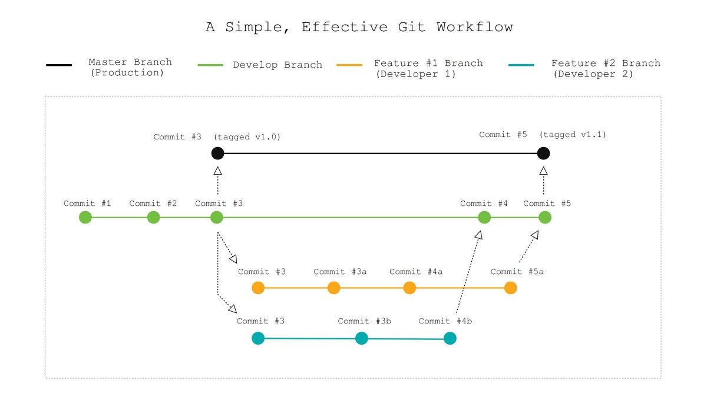

# Finances Website

 A website for a financial company that gives financial solutions and security worldwide.

 ## Table of contents
* [General info](#general-info)
* [Screenshots](#screenshots)
* [Links](#links)
* [Technologies](#technologies)
* [Requirements](#requirements)
* [Features](#features)
* [Status](#status)
* [Workflow](#workflow)
* [Contributors](#contributors)
* [Members roles](#members-roles)

## General info 

The website contains several sections such as home, services, news and contact.
* The home contains an overview about the purposes and goals of the company.
* Services describes what the company offers for the customers.
* The news webpage provides the latest news about the biggest deals and latest companies achievements.
* Contact containes section for contacting the company and another section for viewing the location of the company.

---

## Screenshots 

---

## Links

[Finances Website](https://jevelin.shufflehound.com/finances/#)

---
## Technologies 

The technologies used in this website are :

* HTML(Hyper Text Markup Language)
* CSS (Cascading Styles Sheets)
* Bootstrap 4

---

## Requirements 

* a web browser( Internet explorer 9 and down is not supported)

---

## Features 

* Mobile and tablet friendly
* Well formatted content that is easy to follow
* Smooth and cool animations

--- 

## Status

Project is: in progress
Planning to complete the HTML structure and layout by tuesday May 5,2020 (25%)

---

## Workflow

Workflow procedure :

* a master branch that have only the finished work.
* a develop branch that contains the work that is under developing .
* each member in the team will create a branch from develop branch for the part that he/she is working on.
* after completing the part in the branch will be merged with the develop branch after the review of the team.
* when completing the work on the develop branch it will be merged with the master branch.

---
## Contributors 

- Sarah Mohammed [@GitHub](https://github.com/sara-mohammed96)
- Arvin Alhissou [@GitHub](https://github.com/Arvinalhissou)
- Hussein Talal [@GitHub](https://github.com/husseinTalal2)
- Evan Hameed [@GitHub](https://github.com/evanhameed99)

---

## Members roles 

- Arvin Alhissou(Navbar section until Driven to deliver)
- Evan Hameed (Driven to deliver section until the footer)
- Hussein Talal (Footer section and the news wepage)
- Sarah Mohammed (Contact webpage)