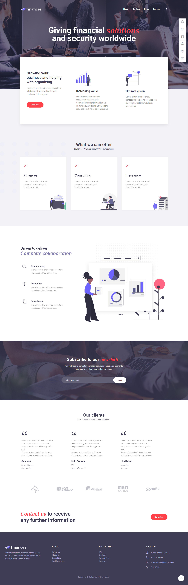
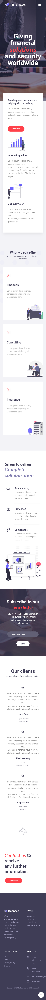
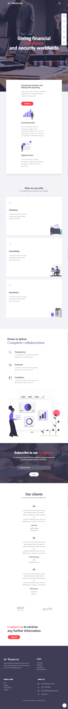

# Finances Website

 A website for a financial company that gives financial solutions and security worldwide.

 ## Table of contents
* [General info](#general-info)
* [Screenshots](#screenshots)
* [Technologies](#technologies)
* [Requirements](#requirements)
* [Features](#features)
* [Status](#status)
* [Contributors](#contributors)

## General info 

The website contains several sections such as home, services, news and contact.
* The home contains an overview about the purposes and goals of the company.
* Services describes what the company offers for the customers.
* The news webpage provides the latest news about the biggest deals and latest companies achievements.
* Contact containes section for contacting the company and another section for viewing the location of the company.

## Screenshots 

## Technologies 

The technologies used in this website are :

* HTML(Hyper Text Markup Language)
* CSS (Cascading Styles Sheets)
* Bootstrap 4
